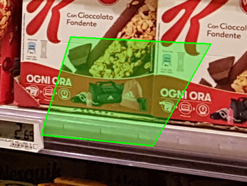

# Segmentation Evaluation Tool

This tool has two main characteristics: 
1. manually segment an image in order to create the **ground truth**
2. evaluate a segmentation through a ground truth in terms of **recall** and **precision**

The documentation is reachable through that [link](https://mett96.github.io/segmentation-evaluation/).


## Table of Content
* [Installation](#Installation)
* [Usage](#Usage)
    * [Segmentation](#Segmentation)
    * [Evaluation](#Evaluation)
* [Version](#Version)
* [Credits](#Credits)
* [License](#License)

 ## Installation
 
 Use _pip_ to install the tool:
 ```shell script
pip install segmentation-evaluation
```

## Usage 
In order to use the tool, open the terminal and digit `segmentation-evaluation`:
```shell script
$ segmentation-evaluation 
```

After that a printed menu is shown:
>**************************************************
>PERFORMANCE TOOL
>1) Press 1 to manually segment the image
>2) Press 2 to evaluate programmatically segmentation
>**************************************************

In order to exit from the menu press `ctrl + c`.

### Segmentation
Choosing `1` from the menu, the segmentation mode is activated.     
After inserted the **absolute path** of the image and the **absolute path* of the folder in which save the results, a window that shows the required image is displayed.


In order to insert a point **DOUBLE CLICK** in the desired position.     
A green point is displayed. Then, inserting another point the segment between the two points is displayed.    
After the third insertion of a point a polygon in which vertexes are the points is shown.
   
 A point | A line            
:-------------------------:|:-------------------------:     
 |       
 A polygon with 3 vertexes | with 4 vertexes      
  |       
     

In addition to inserting new points it is possible to perform several action inserting a specific char while the **image window is shown**.     
The possible actions are:

Char | Action    
----  | :-----    
u | Undo last inserted point    
c | Clear all inserted points (not removes the already saved polygons) 
s | Save points and go to execution to insert label    
q | Terminate the insertion

Once the saving action is a pop up message asks to return to the terminal window where it is possible to insert the label associated to the polygon.    
Then a printed string asks to come back to the image window to insert new polygons.

If you don't want to insert new polygon, come back to the image window and type `q`. A window shows all objects inserted associated to the label and typing again `q` the execution will terminate. 

### Evaluation
In order to perform the evaluation 3 paths need provided:
1. path to the JSON file representing the correct segmentation, the ground truth
2. path to the JSON file representing the segmentation to evaluate
3. path to the folder in which save the evaluation

The evaluation is performed computing the recall and precision values.
In order to consider a match good, the object has to satisfy an intersection over the union greater or equal than 80%.

The results are saved into a json file containing several values, the associated key is the label matched in both json files as input.
In addition a final value that collects overall parameters associated to the key `overall_performance`.    
Each item of the dictionary is another dictionary containing these keys:
- `"n_good_match"`: number of polygons matched between the two json files
- `"n_correct"`: number of polygons present in the ground truth
- `"n_found"`: number of polygons present in the segmentation to evaluate
- `"recall"`: n_good_match / n_correct
- `"precision"`: n_good_match / n_found

**NB**: the structure of the inputted json must be compliant with the following structure:
```json
{
    "0": {
        "label": "name",
        "points": [
            [803, 1138],
            [980, 1167],
            [972, 1370],
            [797, 1331]
        ]
    },
    "1": {
        "label": "",
        "points": []
    }
}
```  
The main keys is an incremental value that identify uniquely the polygon.     
Each polygon must contain a key `"label"` with the name (as string) and `"points"` that has a list as value, the list contains the vertexes of the polygon. Each vertex is a point represented by a list or a tuple of the (x, y) coordinate.

## Version
- `1.0`: first release 

## Credits 
The tool was written by:
- Mattia Sanchioni    [](https://github.com/mett96)
- Alessandro Concetti    [](https://github.com/AleConcetti)

## License
This project is under the GPL-3.0 license - see the [LICENSE.md](LICENSE.md) file for more details    